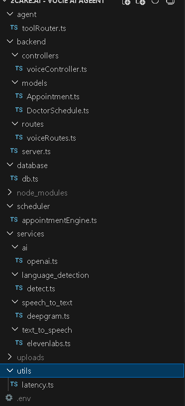

# Voice AI Agent (Node.js + TypeScript)

A backend system that enables real-time voice interaction with an AI assistant.
The application converts speech into text, processes it with an AI model, performs actions like appointment scheduling, and returns a spoken response.

## Features

* Speech-to-text transcription
* AI-powered conversation
* Language detection
* Text-to-speech voice responses
* Appointment scheduling engine
* MongoDB database integration
* Modular AI service architecture
* REST API backend

## Tech Stack

Backend Framework:

* Node.js
* TypeScript
* Express.js

AI & Voice Services:

* Deepgram — Speech-to-Text
* OpenAI — AI reasoning and conversation
* ElevenLabs — Text-to-Speech

Database:

* MongoDB
* Mongoose

Other Tools:

* Multer (audio uploads)
* dotenv (environment variables)

## Project Structure

```text
project-root/
│
├── agent/
│   └── toolRouter.ts
│
├── backend/
│   ├── controllers/
│   │   └── voiceController.ts
│   │
│   ├── models/
│   │   ├── Appointment.ts
│   │   └── DoctorSchedule.ts
│   │
│   ├── routes/
│   │   └── voiceRoutes.ts
│   │
│   └── server.ts
│
├── database/
│   └── db.ts
│
├── scheduler/
│   └── appointmentEngine.ts
│
├── services/
│   ├── ai/
│   │   └── openai.ts
│   │
│   ├── language_detection/
│   │   └── detect.ts
│   │
│   ├── speech_to_text/
│   │   └── deepgram.ts
│   │
│   └── text_to_speech/
│       └── elevenlabs.ts
│
├── uploads/
│
├── utils/
│   └── latency.ts
│
├── .env
├── .gitignore
├── package.json
├── tsconfig.json
└── README.md
```

## Architecture Image




## Installation

Clone the repository:

```bash
git clone https://github.com/ananthumk/voice-ai-agent.git
```

Install dependencies:

```bash
npm install
```

## Environment Variables

Create a `.env` file in the root directory.

Example configuration:

```env
PORT=3000
MONGO_URI=mongodb://localhost:27017/voice-agent Or use mongo atlas

OPENAI_API_KEY=
DEEPGRAM_API_KEY=
ELEVENLABS_API_KEY=

```


## Running the Server

Start the backend server:

```bash
npx ts-node backend/server.ts
```

Server will start at:

```
http://localhost:3000
```

## API Endpoint

### Upload Voice

POST `/voice`

Request body (form-data):

| Key   | Type |
| ----- | ---- |
| audio | File |

Example response:

```json
{
  "message": "Audio uploaded",
  "file": {
    "filename": "timestamp-audio.wav"
  }
}
```

## Voice Processing Pipeline

1. User sends voice input
2. Audio is uploaded to the server
3. Speech is converted to text
4. Language is detected
5. AI processes the request
6. Appointment engine handles scheduling tasks
7. AI response is generated
8. Response is converted to speech
9. Audio response is returned to the user

## Core Components

Speech Processing
Handles audio transcription using Deepgram.

AI Processing
Uses OpenAI to understand user intent and generate responses.

Language Detection
Detects the language of the user input.

Appointment Engine
Schedules and manages appointments using the internal scheduler.

Text-to-Speech
Converts AI responses into audio using ElevenLabs.

## Security

* API keys stored in `.env`
* `.env` excluded from Git via `.gitignore`
* Sensitive credentials should never be pushed to public repositories

## Future Improvements

* Real-time streaming voice conversations
* Web or mobile frontend
* Multi-language voice agents
* Tool-calling AI agents
* Conversation memory and context

## License

MIT License
